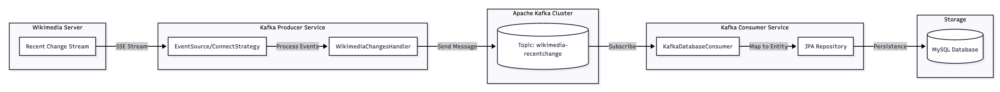

# SpringBoot-Kafka-Wikimedia-Streamer-App

# Real-Time Wikimedia Stream Processing with Kafka & MySQL

A robust real-time data pipeline built with **Spring Boot** and **Apache Kafka** that consumes live recent change events from Wikimedia, streams them through a Kafka broker, and persists the data into a **MySQL** database.

## 🚀 Project Workflow
1.  **Producer Service**: Uses `okhttp-eventsource` to connect to the Wikimedia SSE (Server-Sent Events) stream.
2.  **Kafka Broker**: Acts as the distributed messaging backbone, holding events in the `wikimedia-recentchange` topic.
3.  **Consumer Service**: Subscribes to the Kafka topic and uses **Spring Data JPA** to save incoming JSON strings into a MySQL table.

## 🛠️ Technology Stack
* **Java 17**
* **Spring Boot 3.x**
* **Apache Kafka** (KRaft mode)
* **MySQL**
* **Lombok** (For boilerplate-free entities)
* **OkHttp EventSource** (For SSE consumption)


## 🔄 System Architecture


## ⚙️ Local Setup

### 1. Database Configuration
Create the database in your local MySQL instance:
```sql
CREATE DATABASE wikimedia;
```

Ensure your application.properties in the consumer module has the correct credentials:
```
spring.datasource.url=jdbc:mysql://localhost:3306/wikimedia
spring.datasource.username=root
spring.datasource.password=your_password
spring.jpa.hibernate.ddl-auto=update
```

### 2. Local Kafka Setup
Since this project uses the latest Spring Boot features, follow these steps to run Kafka without Zookeeper:

1. Download & Extract: Get the latest binaries from kafka.apache.org.
2. Navigate to Folder:
   ```cd kafka_2.13-x.x.x```
3. Generate Cluster ID: ```KAFKA_CLUSTER_ID=$(bin/kafka-storage.sh random-uuid)```
4. Format Storage: ```bin/kafka-storage.sh format -t $KAFKA_CLUSTER_ID -c config/kraft/server.properties```
5. Start Server: ```bin/kafka-server-start.sh config/kraft/server.properties```

### 3. Running the Application
1. Clone the Repo: ```git clone git@github.com:mishramayan/Spring_Boot-and-Kafka.git```
2. Build and Run: ```mvn clean install```
   ```mvn spring-boot:run```
3. Run the Producer: Start the producer module to begin fetching Wikimedia events.
4. Run the Consumer: Start the consumer-database module to begin persisting data to MySQL.

